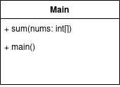
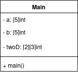
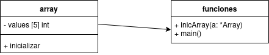
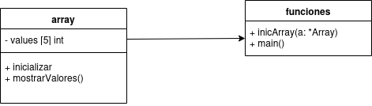
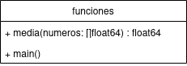
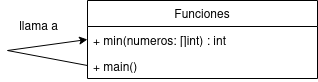
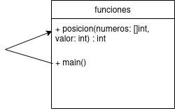
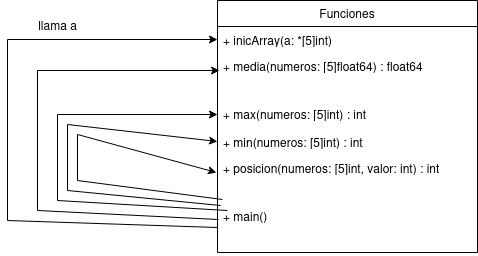

# Practica 1 | Christian Marina Villasevil

# Sistemas Distribuidos

## Grado en Ingeniería Telemática

## Introducción a GO

### Códigos 

***

1. Describir el siguiente código en un diagrama de UML y pseudocódigo.

```go
package main
import "fmt"
func main() {
	const LENGTH int = 10
	const WIDTH int = 5
	var area int
	area = LENGTH * WIDTH
	fmt.Printf(”Valor del área: %d", area)
}
```

**Pseudocódigo**:

	INICIO
	
		Constante length ← 10
		Constante width ← 5
		Variable Área Entero

		área ← Length * width

		Imprimir “Valor del área: “ + área

	FIN

1. Definimos dos constantes LENGTH y WIDTH
2. Definimos una variable ÁREA para almacenar el resultado
3. Realizamos el cálculo del área multiplicando Length por Width
4. Imprimimos el valor del área

**Diagrama de flujo:**


***

**2. Describir el siguiente código en un diagrama UML y un pseudocódigo**

```go
package main
import “fmt”
func main() {
	var grade string = “B”
	var marks int = 90
	switch marks {
		case 90: grade = “A”
		case 80: grade = “B”
		case 50,60,70: grade = “C”
		default: grade = “D”
	}
	switch {
		case grade == “A” :
			fmt.Printf(“Excellent!\n”)
		case grade == “B”, grade == “C” :
			fmt.Printf(“Well done\n”)
		case grade == “D”:
			fmt.Printf(“You passed\n”)
		case grade == “F”:
			fmt.Printf(“Better try again\n”)
		default:
			fmt.Printf(“Invalid grade\n”)
	}
fmt.Printf(“Your grade is %s\n”, grade)
}
```

Pseudocodigo:


INICIO

	Variable grade  Tipo string ← “B”
	Variable marks  Tipo entero ← 90

	Según valor de marks

		CASO 90:
			grade ← “A”
		CASO 80:
			grade ← “B”
		CASO 50, 60, 70:
			grade ← “C”
		CASO Contrario:
			grade ← “D”
	Fin Según

	Según valor de grade
		CASO grade = "A": 
			IMPRIMIR "Excellent!" 
		CASO grade = "B", grade = "C": 
			IMPRIMIR "Well done" 
		CASO grade = "D": 
			IMPRIMIR "You passed" 
		CASO grade = "F": 
			IMPRIMIR "Better try again" 
		CASO CONTRARIO: 
			IMPRIMIR "Invalid grade" 
	FIN SEGÚN 
	IMPRIMIR "Your grade is " + grade 
FIN

1. Inicializamos dos variables que serán grade(una cadena) y marks(entero)
2. La estructura del primer switch determina el valor de grade según el valor de marks
3. La segunda estructura imprime un mensaje según el valor de grade
4. Por último, se imprime el valor de grade.

Diagrama de flujo:


***

**3. Describir el siguiente código en un diagrama UML y un pseudocódigo**

```go
package main
import "fmt"
func sum(nums ...int) {
	fmt.Print(nums, " ")
	total := 0
	for _, num := range nums {
		total += num
	}
	fmt.Println(total)
}
func main() {
	sum(1, 2)
	sum(1, 2, 3)
	nums := []int{1, 2, 3, 4}
	sum(nums...)
}
```

Pseudocodigo:

INICIO

Función sum( nums…)

	Imprimir nums
	total ← 0
	Para cada num en nums hacer:
		total ← total + num
	fin para
	imprimir total
Fin función  

función main:

	llamar sum(1, 2)
	llamar sum(1, 2, 3)

	nums ← [1, 2, 3, 4]
	llamar sum(nums…)
fin función

FIN

Tenemos 2 funciones, la función sum y la función main:

sum:

1. Se imprime la lista de los números recibidos
2. Inicializamos la variable total a 0
3. Podemos ver que para cada numero en la lista, se va sumando el total
4.  Al final, se imprime el valor de total.


Main:

1. En esta función se realizaran varias llamadas a la función anterior sum.
2. La primera llamada será con los números 1 y 2, y la segunda llamada serán con los números 1, 2, y 3.
3. Se crea una lista que se llama nums y en esta lista contiene los números de 1,2,3,4 y luego se le pasa como un argumento a la función sum.
	 

Diagrama de clases:



Explicación:

    La clase Main tiene dos métodos:

        sum(nums: int[]): acepta un número variable de enteros (representados como un array de enteros en el diagrama).

        main(): ejecuta la lógica principal llamando a la función sum con diferentes conjuntos de números.


***

**4. Describir el siguiente código en un diagrama UML y un pseudocódigo**

```go
package main
import "fmt"
func main() {
	var a[5] int
	fmt.Println("emp:", a)
	a[4] = 100
	fmt.Println("set:", a)
	fmt.Println("get:", a[4])
	fmt.Println("len:", len(a))
	b := [5] int{1, 2, 3, 4, 5}
	fmt.Println("dcl:", b)
	var twoD [2][3] int
	for i := 0; i < 2; i++ {
		for j := 0; j < 3; j++ {
			twoD[i][j] = i + j
		}
	}
	fmt.Println("2d: ", twoD)
}
```

Pseudocodigo:

1. Inicio el programa, donde podemos declarar e inicializar una serie de variables.
2. Declaramos una variable a de 5 enteros
3. Imprimimos la variable a inicializar, que imprimirá ceros porque no se han asignado valores
4. Ahora, asignamos valores, en este caso asignamos el valor 100 a la variable a
5. Imprimimos la variable a despues de la asignación
6. Después vamos a imprimir el valor que se encuentra en la posición 4 de la variable a
7. Con el comando len nos va a imprimir la longitud de la variable a, que tiene 5 elementos
8. Se declara e inicializa una nueva variable b de tamaño 5, los elementos son 1, 2, 3, 4, 5
9. Imprimimos el contenido de la variable b
10. Declaramos una matriz bidimensional de 2 filas y 3 columnas twoD[2][3], inicializada a 0
11. Ahora utilizaremos un bucle for para recorrer y asignar valores a cda elemento de la matriz que hemos definido anteriormente, con ello llenaremos la matriz con la suma de los indices i y j. Primero se recorre las filas, para cada j en el rango de 0 a 2 y después se recorre la segunda con el indice i , y asignamos el valor de  i + j  al elemento de la matriz twoD[i][j]

12. Por último imprimimos la matriz twoD
13. Fin del programa.


Diagrama de clases:



Explicación:

    La clase Main contiene tres atributos, que son los arrays (a, b, twoD).
	
    La única función es main(), donde se ejecuta la lógica del programa.

*** 

### Programas.

***

**1. Implementa una función para inicializar las posiciones del array**

Código:

```go
package main

import "fmt"

// Función para inicializar el array con valores
func inicArray(a *[5]int) {
	for i := 0; i < len(a); i++ {
		a[i] = i * 10 // se asigna un valor
	}
}

func main() {

	var a [5]int //declarar un array de tamaño 5
	fmt.Println("Antes de inicializar: ", a)

	inicArray(&a) // inicializar el array
	fmt.Println("Despues de inicializar: ", a)
}
```

Pseudocódigo:

INICIO

    // Definir una función para inicializar el array
    FUNCIÓN inicArray(a como referencia a un array de 5 enteros)
        PARA i desde 0 hasta tamaño del array - 1
            a[i] = i * 10 // Asignar valor al elemento del array
        FIN PARA
    FIN FUNCIÓN

    // Función principal
    INICIO
        DECLARAR a como un array de tamaño 5 de enteros
        IMPRIMIR "Antes de inicializar: " y el array a
        
        LLAMAR a la función inicArray pasando la referencia del array a
        IMPRIMIR "Después de inicializar: " y el array a
    FIN

FIN

1. Declarar una función inicArray:

    Esta función recibe una referencia a un array de 5 enteros.
    Itera sobre cada índice del array desde 0 hasta 4.
    En cada iteración, asigna el valor de i * 10 al elemento en el índice i del array.

2. En la función principal (main):

    Declarar un array a de tamaño 5 con elementos enteros, inicialmente todos son ceros.
    Imprimir el estado del array a antes de ser inicializado con la función inicArray.

3. Llamar a la función inicArray:

    Pasar el array a por referencia a la función inicArray.
    La función inicializa los valores del array.

4. Imprimir el array:

    Después de llamar a inicArray, imprimir nuevamente el array a para mostrar los valores actualizados.

Diagrama de clases:



***

**2. Implementa una función para imprimir las posiciones del array**

Código:

```go

package main

import "fmt"

// Función para inicializar el array con valores
func inicArray(a *[5]int) {
	for i := 0; i < len(a); i++ {
		a[i] = i * 10 // se asigna un valor
	}
}

func main() {

	var a [5]int //declarar un array de tamaño 5
	fmt.Println("Antes de inicializar: ", a)

	inicArray(&a) // inicializar el array
	fmt.Println("Despues de inicializar: ", a)

	fmt.Println("Posiciones y valores del array")
	for i := 0; i < len(a); i++{
		fmt.Printf("Posicion %d: %d\n", i, a[i])
	}

}

```

Pseudocódigo:

INICIO

    // Definir una función para inicializar el array
    FUNCIÓN inicArray(a como referencia a un array de 5 enteros)
        PARA i desde 0 hasta tamaño del array - 1
            a[i] = i * 10 // Asignar valor al elemento del array
        FIN PARA
    FIN FUNCIÓN

    // Función principal
    INICIO
        DECLARAR a como un array de tamaño 5 de enteros
        IMPRIMIR "Antes de inicializar: " y el array a
        
        LLAMAR a la función inicArray pasando la referencia del array a
        IMPRIMIR "Después de inicializar: " y el array a
        
        // Imprimir posiciones y valores del array
        IMPRIMIR "Posiciones y valores del array:"
        PARA i desde 0 hasta tamaño del array - 1
            IMPRIMIR "Posición i: " y a[i]
        FIN PARA
    FIN

FIN

1. Definimos la función inicArray:

    Iterar sobre cada posición del array (de 0 a 4).
    Asignar el valor i * 10 a cada posición.

2. En la función principal:

    Declaramos un array a de tamaño 5.
    Imprimimos el array antes de inicializarlo.

3. Llamaremos a inicArray:

    Pasar el array por referencia para que la función lo inicialice.

4. Imprimimos el array:

    Imprimimos el array después de inicializarlo.

5. Imprimimos posiciones y valores:

    Recorreremos el array y para cada posición, imprimir el índice y su valor correspondiente.

Diagrama de clases:



***

**3. Implementa una función que devuelva la media**

Código:

```go
package main

import "fmt"

func media(numeros []float64) float64{
	suma := 0.0
	for _, num:= range numeros {
		suma += num
	}
	return suma / float64(len(numeros))
}

func main(){
	numeros := []float64{2,3,4,5,6}
	fmt.Println(media(numeros))
}
```

Pseudocódigo:

INICIO

	1. Definir la función media(numeros)

		Entrada: lista de numeros decimales.

		Se inicializa suma a 0.

		Para cada num en numeros, sumamos num a suma.

		Retornamos el valor de suma dividido por el tamaño de numeros.
	
	2. Iniciamos el programa principal

		Definimos numeros como una lista de numeros, rellenamos con numeros el array.

		Llamamos a la función media(numeros) y nos mostrará el resultado.

FIN

Diagrama de clases:



***

**4. Implementa una función que devuelva el valor máximo**

Código:

```go
package main

import "fmt"

func max(numeros []int) int {
	max := numeros[0]
	for _, num := range numeros {
		if num > max {
			max = num
		}
	}
	return max
}

func main() {
	numeros := []int{10, 20, 5, 30, 15}
	fmt.Println(max(numeros))
}
```

Pseudocodigo:

INICIO
	1. Definimos la funcion max(numeros)

		Entrada: Una lista de numeros enteros

		Asignamos max como el primer elemento de numeros

		Para cada num en numeros, si num es mayor que max, se le asigna num a max.

		Retornamos max.

	2. Iniciamos el programa principal

		Definimos una lista de numeros que son los que vamos a ver cual es el mayor

		Llamamos a nuestra función max(numeros) y nos mostrará el resultado

Diagrama:

.png)

***

**5. Implementa una función que devuelva el valor mínimo**

Código:

```go
package main

import "fmt"

func min(numeros []int) int {
	min := numeros[0]
	for _, num := range numeros {
		if num < min {
			min = num
		}
	}
	return min
}

func main() {
	numeros := []int{10, 20, 5, 30, 15, 2}
	fmt.Println(min(numeros))
}
```

Pseudocodigo:

INICIO
	1. Definimos la funcion min(numeros).

		Entrada: Una lista de numeros enteros.

		Asignamos min como el primer elemento de numeros.

		Para cada num en numeros, si num es menor que min, se le asigna num a min.

		Retornamos min.

	2. Iniciamos el programa principal.

		Definimos una lista de numeros que son los que vamos a ver cual es el menor.

		Llamamos a nuestra función min(numeros) y nos mostrará el resultado.

Diagrama de clases:



***

**6. Implementa una función que dado un valor, devuelva la posición del array**

Código:

```go

package main

import "fmt"

func posicion(numeros []int, valor int) int {
	for i, num := range numeros {
		if num == valor {
			return i
		}
	}
	return -1
}

func main() {

	numeros := []int{10, 20, 5, 30, 15}
	valor := 3
	fmt.Println("El valor se encuentra en la posicion: ",posicion(numeros, valor))
}
```

Pseudocódigo:

INICIO

	1. Definimos la función posicion(numeros, valor)

		Entrada: una lista de numeros enteros, y valor que es un entero a buscar.

		Para cada num en numeros, con un indice i, si num es igual a valor, retornamos i.

		Retornamos -1 cuando el valor no se encuentra.

	2. Iniciamos el programa principal.

		Definimos una lista de numeros, 10, 20, 5, 30, 15.

		Definimos a valor como 3.

		Por último llamamos a la funcion posicion y mostrará el resultado.

FIN

Diagrama de clases:



***

**7. Escribe un programa en el que te declares un array y desde el invoques a las anteriores funciones a modo de menú.**

```go

package main

import "fmt"

// Función para inicializar el array con valores
func inicArray(a *[5]int) {
	for i := 0; i < len(a); i++ {
		a[i] = i * 10 // Se asigna un valor
	}
}

// Función para calcular la media
func media(numeros [5]float64) float64 {
	suma := 0.0
	for _, num := range numeros {
		suma += num
	}
	return suma / float64(len(numeros))
}

// Función para encontrar el valor máximo
func max(numeros [5]int) int {
	max := numeros[0]
	for _, num := range numeros {
		if num > max {
			max = num
		}
	}
	return max
}

// Función para encontrar el valor mínimo
func min(numeros [5]int) int {
	min := numeros[0]
	for _, num := range numeros {
		if num < min {
			min = num
		}
	}
	return min
}

// Función para encontrar la posición de un valor en el array
func posicion(numeros [5]int, valor int) int {
	for i, num := range numeros {
		if num == valor {
			return i
		}
	}
	return -1
}

func main() {
	var a [5]int // Declarar array de tamaño 5
	inicArray(&a) // Inicializar el array
	fmt.Println("Array inicializado:", a)

	for {
		fmt.Println("\n--- Menú ---")
		fmt.Println("1. Calcular media de números")
		fmt.Println("2. Encontrar valor máximo")
		fmt.Println("3. Encontrar valor mínimo")
		fmt.Println("4. Buscar posición de un valor")
		fmt.Println("5. Salir")
		fmt.Print("Elige una opción: ")

		var opcion int
		fmt.Scanln(&opcion)

		switch opcion {
		case 1:
			numeros := [5]float64{2, 3, 4, 5, 6} // Puedes modificar estos números
			fmt.Println("La media es:", media(numeros))

		case 2:
			fmt.Println("El valor máximo es:", max(a))

		case 3:
			fmt.Println("El valor mínimo es:", min(a))

		case 4:
			var valor int
			fmt.Print("Ingresa el valor a buscar: ")
			fmt.Scanln(&valor)
			pos := posicion(a, valor)
			if pos != -1 {
				fmt.Printf("El valor %d se encuentra en la posición: %d\n", valor, pos)
			} else {
				fmt.Printf("El valor %d no se encontró en el array\n", valor)
			}

		case 5:
			fmt.Println("Saliendo del programa...")
			return

		default:
			fmt.Println("Opción no válida. Intenta de nuevo.")
		}
	}
}

```

Pseudocodigo:

1. Inicialización de Array: Se define una función para inicializar un array de enteros asignando valores a cada posición.

2. Cálculo de Media: Se define una función para calcular la media de un array de números decimales.

3. Valor Máximo y Mínimo: Se definen funciones para encontrar el valor máximo y mínimo en un array de enteros.

4. Buscar Posición: Se define una función que devuelve la posición de un valor dado en un array.

5. Menú Interactivo: En la función principal, se inicializa un array y se presenta un menú interactivo al usuario, permitiéndole seleccionar diferentes opciones para calcular la media, encontrar valores máximo y mínimo, o buscar la posición de un valor en el array.

Diagrama de clases:

