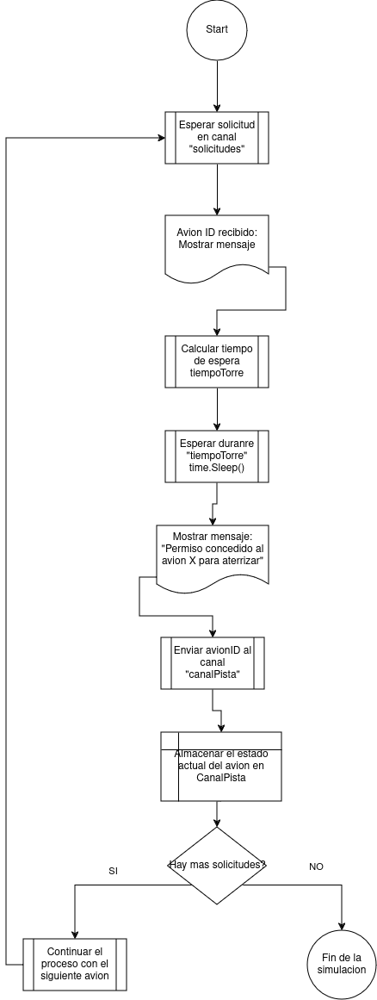
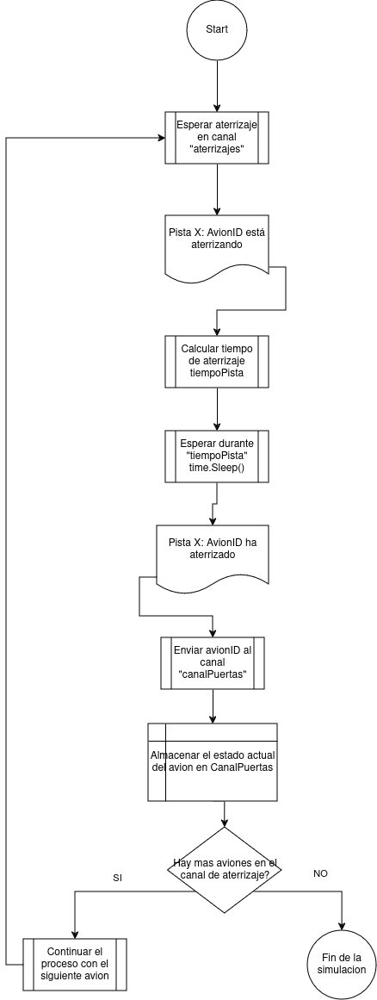
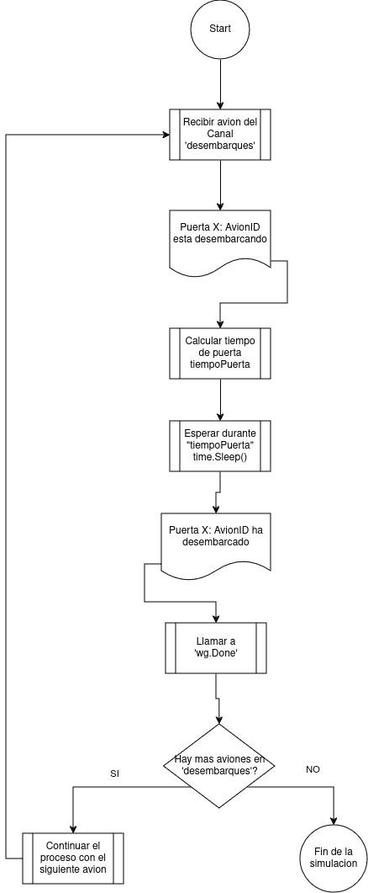
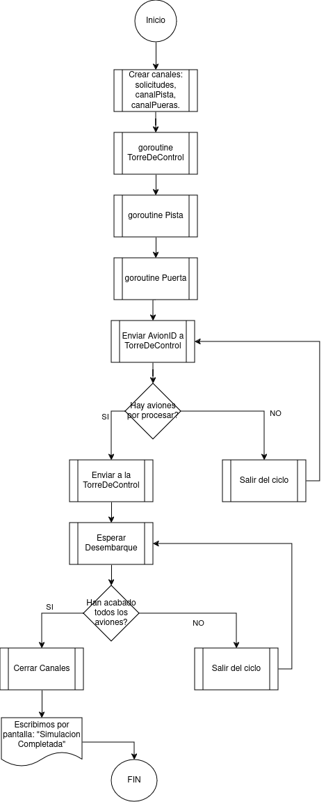

# Práctica 2 - SSOO

## GO Routines

### Christian Marina Villasevil

### **Problema Aeropuerto de la República Bananera**

Una cantidad  N  de aviones de las mismas características y sin prioridades, se aproximan a unaeropuerto donde una torre de control les va asignando el momento en el cual deben aterrizar. Latorre de control dispondrá de las  NumPistas  disponibles en el aeropuerto, siempre y cuando noestén siendo usadas por otro avión. A medida que van terminando su proceso de aterrizaje en pista,proceden a desplazarse a las puertas de desembarque donde los pasajeros podrán ir a por surespectivo equipaje.

### **Enunciado**
Se requiere un programa en GO que modele el comportamiento del sistema anteriormente descrito, de forma que se pueda ejecutar dicha simulación sims veces. El programa debería cumplir las siguientes consideraciones:

	· La torre de control, las pistas y las puertas tienen un tiempo de uso utilización que debe ser contemplado.

	· La torre de control, las pistas y las puertas tienen una variación de tiempo de uso/utilización que debe ser contemplado.

	· La torre de control y las pistas deberían tener una cantidad máxima de aviones esperando a ser atendidos.

	· Se debería visualizar en la ejecución el mensaje de Desembarco del avión N , cuando se termine el proceso de cada uno.

Además de las consideraciones anteriores, el programa debe tener una descripción técnica sobre su estructura de tal manera que una persona que no este familiarizada pueda entender su funcionamiento. Preferiblemente haciendo uso de diagramas UML.

### **Código Principal**

A continuación adjuntaremos el codigo principal de este problema.

```c
package main

import (
	"fmt"
	"math/rand"
	"sync"
	"time"
)

var (
	numAviones       = 10   // Número de aviones en la simulación
	numPistas        = 4    // Número de pistas en el aeropuerto
	numPuertas       = 2    // Número de puertas de desembarque
	sims             = 1    // Número de simulaciones
	maxEsperaTorre   = 4    // Máximo número de aviones en espera en la torre de control
	maxEsperaPista   = 2    // Máximo número de aviones en espera en la pista
	tiempoBaseTorre  = 1    // Tiempo base de uso de la torre de control en segundos
	tiempoBasePista  = 2    // Tiempo base de uso de la pista en segundos
	tiempoBasePuerta = 3    // Tiempo base de uso de la puerta de desembarque en segundos
	variacion        = 0.25 // Variación del tiempo de uso en 25%
)

var wg sync.WaitGroup

// Función para la torre de control
func torreDeControl(solicitudes <-chan int, canalPista chan<- int) {
	for avionID := range solicitudes {
		fmt.Printf("Torre de Control: Avión %d solicitando permiso para aterrizar.\n", avionID)
		// Tiempo variable de la torre de control
		tiempoTorre := tiempoVariable(tiempoBaseTorre)
		time.Sleep(tiempoTorre)
		fmt.Printf("Torre de Control: Permiso concedido al avión %d para aterrizar.\n", avionID)
		canalPista <- avionID // Enviar permiso a la pista
	}
}

// Función para una pista de aterrizaje
func procesarPista(aterrizajes <-chan int, canalPuertas chan<- int, pistaID int) {
	for avionID := range aterrizajes {
		fmt.Printf("Pista %d: Avión %d está aterrizando.\n", pistaID, avionID)
		// Tiempo variable de aterrizaje en la pista
		tiempoPista := tiempoVariable(tiempoBasePista)
		time.Sleep(tiempoPista)
		fmt.Printf("Pista %d: Avión %d ha aterrizado.\n", pistaID, avionID)
		canalPuertas <- avionID // Enviar a desembarque
	}
}

// Función para manejar el desembarque de los aviones
func procesarPuertas(desembarques <-chan int, puertaID int) {
	// Procesar los aviones de manera secuencial
	for avionID := range desembarques {
		fmt.Printf("Puerta %d: Avión %d está desembarcando.\n", puertaID, avionID)
		// Tiempo variable de desembarque
		tiempoPuerta := tiempoVariable(tiempoBasePuerta)
		time.Sleep(tiempoPuerta)
		fmt.Printf("Puerta %d: Desembarco del avión %d completado.\n", puertaID, avionID)
		wg.Done() // Indicar que el avión ha completado su ciclo
	}
}

// Función para calcular un tiempo variable con variación aleatoria
func tiempoVariable(tiempoBase int) time.Duration {
	variacionFactor := 1 + ((rand.Float64()*2)-1)*variacion
	return time.Duration(float64(tiempoBase)*variacionFactor) * time.Second
}

func ejecutarSimulacion(numAviones, numPistas, numPuertas, maxEsperaTorre, maxEsperaPista, tiempoBaseTorre, tiempoBasePista, tiempoBasePuerta int, variacion float64) {
	// Canales para cada etapa del flujo de aviones con límite de espera
	solicitudes := make(chan int, maxEsperaTorre) // Solicitudes de los aviones a torre de control
	canalPista := make(chan int, maxEsperaPista)  // Canal de torre de control a pista
	canalPuertas := make(chan int, numAviones)    // Canal de pista a puerta de desembarque

	// Iniciar goroutine para la torre de control
	go torreDeControl(solicitudes, canalPista)

	// Iniciar múltiples goroutines para pistas
	for i := 1; i <= numPistas; i++ {
		go procesarPista(canalPista, canalPuertas, i)
	}

	// Iniciar múltiples goroutines para las puertas de desembarque
	for i := 1; i <= numPuertas; i++ {
		go procesarPuertas(canalPuertas, i)
	}

	// Enviar aviones (IDs) a la torre de control
	for i := 1; i <= numAviones; i++ {
		wg.Add(1)        // Añadir una tarea al WaitGroup para cada avión
		solicitudes <- i // Enviar solicitud de aterrizaje del avión
	}
	close(solicitudes) // Cerramos el canal de solicitudes tras encolar todos los aviones

	// Esperar a que todos los aviones completen su desembarque
	wg.Wait()
	close(canalPuertas) // Cerrar el canal de desembarque después de que todos los aviones se hayan procesado
	fmt.Println("Simulación completada: Todos los aviones han aterrizado y desembarcado.")
}

func main() {
	// Inicializar generador de números aleatorios
	rand.Seed(time.Now().UnixNano())

	// Ejecutar la simulación múltiples veces
	for i := 1; i <= sims; i++ {
		fmt.Printf("\n=== Ejecución de la Simulación %d ===\n", i)
		ejecutarSimulacion(numAviones, numPistas, numPuertas, maxEsperaTorre, maxEsperaPista, tiempoBaseTorre, tiempoBasePista, tiempoBasePuerta, variacion)
	}
}
```


Este programa simula el flujo de aterrizaje y desembarque de aviones en un aeropuerto utilizando concurrencia en Go. El flujo consta de tres etapas principales:

    1. Torre de control: Los aviones solicitan permiso para aterrizar. La torre procesa cada solicitud con un tiempo variable y luego envía el permiso a una pista.

    2. Pistas de aterrizaje: Las pistas procesan los aterrizajes de los aviones, simulando un tiempo variable de aterrizaje. Una vez aterrizados, los aviones se envían a las puertas de desembarque.

    3. Puertas de desembarque: Los aviones son desembarcados de forma secuencial, cada uno con un tiempo variable.

La simulación utiliza canales para comunicar las diferentes etapas y un sync.WaitGroup para esperar a que todos los aviones completen su ciclo. Además, se introduce variabilidad en los tiempos de procesamiento para simular situaciones reales. El programa puede configurarse con diferentes números de aviones, pistas, y puertas. Al finalizar, imprime el estado de cada avión en cada etapa.

### **Test** 

El código presenta tests de simulación que evalúan el impacto de diferentes configuraciones en el tiempo de ejecución de un sistema de simulación de tráfico aéreo. Cada test compara la duración de las simulaciones al modificar una o más variables del sistema. Vamos a desglosar cada test:

**1. TestDuplicarMaxEsperaTorre**

**Propósito:** Compara la duración de la simulación cuando la cantidad máxima de espera en la torre (maxEsperaTorre) se mantiene en su valor original versus cuando este valor se duplica.

**Pasos:**

    1. Guarda el valor original de maxEsperaTorre.
    2. Duplica su valor (duplicadoMaxEsperaTorre).
    3. Ejecuta dos simulaciones:
        Con el valor original de maxEsperaTorre.
        Con el valor duplicado.
    4. Imprime y compara las duraciones de ambas simulaciones.

**Cambio realizado:**

    La cantidad máxima de espera en la torre se duplica.

**Resultados:**

Duplicar maxEsperaTorre permite manejar más solicitudes de aterrizaje de manera simultánea, pero introduce mayor complejidad en la gestión de recursos compartidos, como pistas y puertas. Esto resulta en un incremento en la duración total de la simulación.

Comparación cuantitativa:

    Duración con maxEsperaTorre = 4: 14.0053 segundos.
    Duración con maxEsperaTorre = 8: 16.0065 segundos.
    Incremento porcentual en la duración: ~14.3%.

Este aumento de aproximadamente 2 segundos es una cantidad razonable y refleja el impacto de permitir que más aviones esperen en la torre y, por lo tanto, en los recursos del sistema.


**2. TestAumentarVariacion**

**Propósito:** Evalúa el impacto de aumentar la variación de tiempo (variacion) en un 25% sobre el tiempo base.

**Pasos:**

    1. Guarda el valor original de variacion.
    2. Incrementa su valor en un 25% (incrementoVariacion = variacion * 1.25).
    3. Ejecuta dos simulaciones:
        Con la variación original.
        Con la variación aumentada en un 25%.
    4. Imprime y compara las duraciones.

**Cambio realizado:**

    Incremento del 25% en la variación de los tiempos.

**Resultados:**

Simulación con la variación original (0.25):
Duración: 15.0081 segundos.

    En esta simulación, el sistema opera con una configuración estándar en la que se manejan 10 aviones que solicitan aterrizar y desembarcar. El flujo de trabajo en la torre de control y las pistas parece ser eficiente, y todos los aviones aterrizan y desembarcan sin problemas.

Simulación con la variación aumentada (0.31):
Duración: 15.0068 segundos.

    Esta simulación aumenta la variación en un 25% (de 0.25 a 0.31), lo cual probablemente tenga que ver con un cambio en algún parámetro relacionado con el comportamiento de la torre de control, como el tiempo que los aviones deben esperar para recibir permiso para aterrizar o algún otro parámetro de la simulación que afecte la dinámica de los aterrizajes y desembarques.


**3. TestDuplicarMaxEsperaYVariacion**

**Propósito:** Analiza el efecto combinado de duplicar el tiempo máximo de espera en la torre (maxEsperaTorre) y aumentar la variación (variacion) en un 25%.

**Pasos:**

    1. Duplica el valor de maxEsperaTorre.
    2. Incrementa la variación en un 25%.
    3. Ejecuta dos simulaciones:
        Con valores originales de maxEsperaTorre y variacion.
        Con los valores modificados.
    4. Imprime y compara las duraciones.

**Cambio realizado:**

    Combinación de duplicar el tiempo máximo de espera en la torre y aumentar la variación en un 25%.

**Resultados:**

Simulación con maxEsperaTorre (4) y variación (0.25):

    Duración: 16.0082 segundos
    Fluctuaciones en el tiempo de aterrizaje o desembarque son mínimas, y el flujo de aviones es eficiente.

Simulación con maxEsperaTorre duplicado (8) y variación aumentada (0.31):

    Duración: 14.0048 segundos
    A pesar de un mayor tiempo de espera y una variación más alta, la simulación completa la tarea de manera más rápida, lo cual indica que el aumento en el tiempo de espera mejora la eficiencia general al evitar cuellos de botella.


**4. TestMultiplicarPistas**

**Propósito:** Evalúa el impacto de multiplicar por 5 el número de pistas (numPistas) disponibles.

**Pasos:**

    1. Guarda el número original de pistas (numPistas).
    2. Multiplica el número de pistas por 5 (numPistasMultiplicadas).
    3. Ejecuta dos simulaciones:
        Con el número original de pistas.
        Con el número de pistas multiplicado por 5.
    4. Imprime y compara las duraciones.

**Cambio realizado:**

    Incremento del número de pistas disponibles.

**Resultados:**

Simulación con 4 pistas:

    Duración: 14.0049 segundos
    El número de pistas (4) es suficiente para gestionar los aterrizajes y desembarques de los aviones de manera eficiente, con un tiempo de simulación relativamente corto.

Simulación con 20 pistas:

    Duración: 15.0079 segundos
    A pesar de tener más pistas disponibles, la simulación tarda más tiempo. Esto sugiere que la adición de más pistas no necesariamente mejora el rendimiento de la simulación. El sistema podría estar realizando tareas adicionales de gestión (por ejemplo, asignación de pistas, sincronización) que consumen más tiempo, sin una mejora significativa en la duración total del proceso.

**5. TestMultiplicarPistasConMayorTiempo**

**Propósito:** Compara el efecto de multiplicar el número de pistas por 5 y, simultáneamente, incrementar el tiempo base de utilización de cada pista en 5 veces.

**Pasos:**

    1. Multiplica el número de pistas por 5 (numPistasMultiplicadas).
    2. Incrementa el tiempo base de cada pista en 5 veces (tiempoBasePistaMultiplicado).
    3. Ejecuta dos simulaciones:
        Con el número y tiempo base originales de las pistas.
        Con el número de pistas y tiempo base multiplicados.
    4. Imprime y compara las duraciones.

**Cambio realizado:**

    Aumenta tanto el número de pistas como su tiempo base de utilización.

**Resultados:**

Simulación con 4 pistas y tiempo base de pista de 2:

    Duración: 15.0061 segundos
    El sistema maneja de forma eficiente los aterrizajes y desembarques con el número original de pistas y un tiempo base moderado para cada aterrizaje.

Simulación con 20 pistas y tiempo base de pista de 10:

    Duración: 14.0064 segundos
    A pesar de que se aumentó tanto el número de pistas (5 veces más) como el tiempo base de pista (5 veces más), la simulación terminó siendo más rápida en esta configuración. Esto podría ser debido a una mejor distribución de los aterrizajes en las múltiples pistas disponibles, aunque cada aterrizaje tarda más tiempo.


### **Diagramas UML**

Este primer diagrama UML corresponde a la función **TorreDeControl**, en esta función se realiza las solicitudes de aterrizaje de los aviones, y la torre de control les concede el permiso para ello:



Este siguiente diagrama UML corresponde a la función **procesarPista**, en esta función se le adjunta una pista a cada avión para que pueda proceder a aterrizar:



Este siguiente diagrama UML corresponde a la función **procesarPuerttas**, en esta otra función se le asigna una puerta de desembarque a cada avión que anteriormente esta en una pista para que pueda desembarcar:



Y por último tenemos el diagrama UML correspondiente a la función principal que nos permite realizar las simulaciones, **ejecutarSimulacion**:

